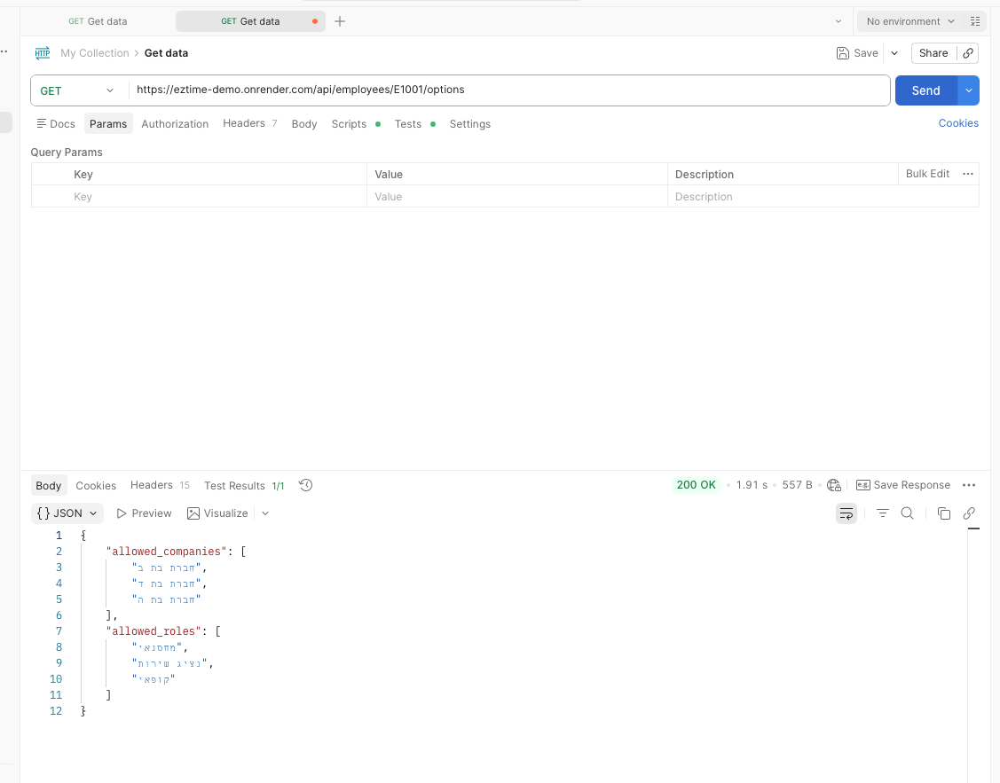
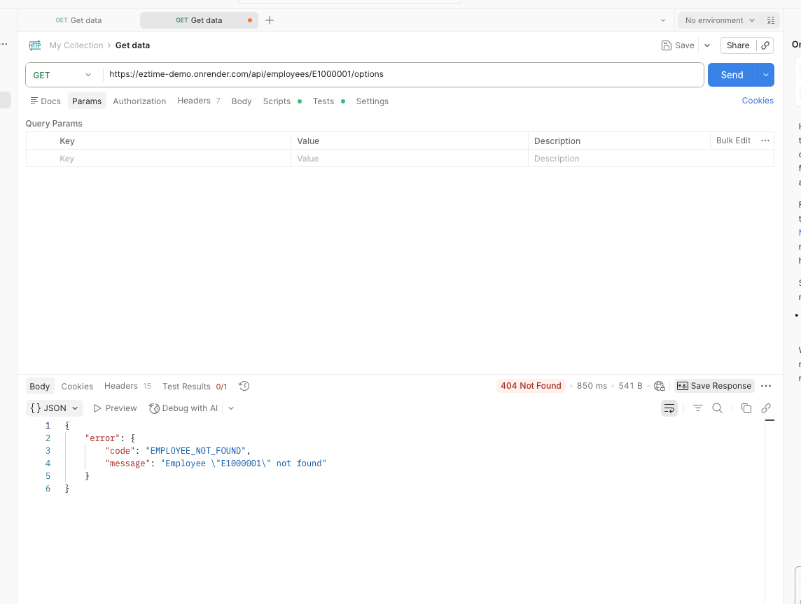

# EZTime - Attendance & Payroll POC
## Submission Document | Ido Shkuri

**Live System:** https://eztime-demo.onrender.com
**Source Code:** https://github.com/idoshkur/eztime-demo

---

## AI Tools 

This project was built with extensive use of AI tools:
- **Claude Code (Anthropic)** — Used for the entire codebase implementation: backend, frontend, database, deployment, and debugging. All code was generated, reviewed, and iterated through Claude Code.
- **ChatGPT (OpenAI)** — Used for initial PRD (Product Requirements Document) creation and product specification drafts.
- **Gemini (Google)** — Used for additional spec refinement and architectural brainstorming.

---

# Part A: Architecture & Product Design (Theoretical)

## Background & Core Challenges

Managing a workforce within a complex multi-site organization introduces two primary challenges:

1. **Data Reliability:** Preventing fraudulent reporting (e.g., remote check-ins) and ensuring verified employee identity.
2. **Accurate Attribution:** Ensuring working hours are assigned to the correct site and role, especially when employees perform multiple roles or work at different sites on the same day.

The key business risk is not only inaccurate hour reporting, but incorrect attribution of hours to a higher-paying site or role, which may lead to payroll inaccuracies and financial exposure.

### Selected Product Concept: Passive Reporter Model

The employee is defined as a **passive reporter**:
- The employee does **not** select: the site, the role, or the pay rate
- All shift parameters are predefined in the scheduling system by the employer
- The employee only confirms physical presence (check-in / check-out)

This approach significantly reduces manipulation risk and strengthens operational control.

---

## 1. Technological Solutions for Data Collection & Reliability

### Solution A: Physical Attendance Terminal (Biometric / Smart Card)

**Description:** A physical attendance terminal is installed at each work site, allowing employees to check in and out using fingerprint authentication or a smart employee card.

**Operational Flow:**
1. The manager defines a daily schedule in advance.
2. The employee arrives at the site and performs a clock-in at the terminal.
3. The server performs validation checks: an active schedule exists, entry time is within acceptable deviation limits.
4. The event is automatically linked to the predefined schedule.
5. The employee cannot modify the site or role.

| Advantages | Disadvantages |
|------------|---------------|
| Highest fraud prevention (prevents buddy punching and remote reporting) | Hardware costs (purchase, installation, maintenance) |
| No smartphone/battery/data plan required | Physical setup and deployment time |
| Simple "touch and go" UX | Less suitable for temporary sites |
| Works in GPS-restricted areas (underground, warehouses) | |

**RICE Evaluation:**
- **Reach:** Very High (up to 100% of workforce)
- **Impact:** High (complete identity verification)
- **Confidence:** Very High (biometric/site-based validation)
- **Effort:** Medium (hardware logistics and installation)

**Business Fit:** Best for permanent, high-volume, or sensitive sites where maximum reliability is required.

### Solution B: Location-Based Mobile Application

**Description:** A mobile application that allows attendance reporting only when the employee is within a predefined geographic radius of the assigned work site.

**Operational Flow:**
1. The manager defines a daily schedule.
2. The employee arrives and opens the app.
3. "Check-In" becomes active only if the employee is within the defined radius and an active schedule exists.
4. The event is stored with timestamp and location metadata.

| Advantages | Disadvantages |
|------------|---------------|
| Immediate deployment across thousands of sites | Privacy concerns (location tracking) |
| Minimal cost (software-only) | Requires smartphone with sufficient battery |
| Real-time push notifications | Moderate reliability (GPS can be inaccurate indoors) |
| Easily supports temporary sites | |

**RICE Evaluation:**
- **Reach:** Medium–High (depends on workforce demographics)
- **Impact:** Medium–High (significant improvement over manual reporting)
- **Confidence:** Medium (GPS limitations)
- **Effort:** Low (software development only)

**Business Fit:** Best for temporary, distributed, or mobile workforce environments.

### Recommended Business Approach

Given the sensitivity of payroll accuracy and the financial risk associated with incorrect role attribution, the chosen solution is **Physical Attendance Terminals (Solution A)**.

This provides: the highest level of identity verification, elimination of personal device dependency, reliable on-site presence validation, and maximum payroll accuracy in role-based compensation environments.

---

## 2. Data Flow Architecture

### Architectural Principle

The system follows an **event-driven architecture** and separates:
- **Raw Data Layer:** Attendance events as recorded
- **Business Processing Layer:** Hour calculation, overtime classification, and payroll preparation

This separation ensures scalability and flexibility for future policy changes.

### Step 1: Event Capture (Client Layer)

The endpoint sends a raw event object (without hour calculations):

```json
{
  "event_id": "uuid-12345",
  "employee_id": "E1001",
  "timestamp": "2026-02-04T07:15:00Z",
  "event_type": "CHECK_IN",
  "source": {
    "type": "BIOMETRIC_TERMINAL",
    "device_id": "TERM-SOUTH-04"
  },
  "verification": {
    "method": "FINGERPRINT",
    "status": "SUCCESS"
  }
}
```

### Step 2: Validation & Alerting

The server validates: an active scheduled shift exists, time deviation is within tolerance, logical sequence (no check-out without check-in).

If validation fails, an alert is generated:

```json
{
  "alert_type": "UNAUTHORIZED_REPORT",
  "severity": "CRITICAL",
  "message": "Employee E1001 is not scheduled for SITE_SOUTH today",
  "actions": ["NOTIFY_MANAGER", "NOTIFY_EMPLOYEE_PUSH"],
  "original_event_id": "uuid-12345"
}
```

All events, including rejected ones, are stored for audit purposes.

### Step 3: Work Session Builder

Matching check-in and check-out events create a session:

```json
{
  "session_id": "sess-9988",
  "employee_id": "E1001",
  "site_id": "SITE_402",
  "role_id": "WAREHOUSE_OP",
  "actual_start": "2026-02-04T07:15:00Z",
  "actual_end": "2026-02-04T16:45:00Z"
}
```

Multiple sessions per day are supported (split shifts).

### Step 4: Daily Hours Classification

**Step 4.1 — Aggregate Daily Work Time:** All sessions on the same day are summed. Split shifts are combined before overtime logic.

**Step 4.2 — Determine Overtime Threshold:**
- Default: overtime begins after **8 hours**
- Night rule: if night_hours >= 2 (between 22:00–06:00), threshold drops to **7 hours**

**Step 4.3 — Classify Hours into Payment Tiers:**
- **100% (Regular):** Up to the overtime threshold (7 or 8 hours)
- **125% (Overtime Level 1):** From the threshold up to 10 total hours
- **150% (Overtime Level 2):** Any hours beyond 10 total hours

*Example: Employee worked 10.5 hours, no night shift → threshold = 8 → Regular = 8h, 125% = 2h, 150% = 0.5h*

### Step 5: Rate Assignment & Salary Calculation

**Step 5.1 — Applied Rate:** If the employee worked at multiple sites/roles on the same day:
`applied_hourly_rate = MAX(hourly_rate)` across all entries that day.

**Step 5.2 — Gross Daily Salary:**
```
salary_100 = hours_100 × rate
salary_125 = hours_125 × rate × 1.25
salary_150 = hours_150 × rate × 1.5
gross_daily_salary = salary_100 + salary_125 + salary_150
```

*Example: rate = ₪87 → 8×87 + 2×87×1.25 + 0.5×87×1.5 = 696 + 217.5 + 65.25 = **₪978.75***

### Step 6: Audit & Transparency

All raw events are permanently stored, including rejected reports. This enables: recalculation if rules change, dispute resolution, full client transparency, and historical payroll reconstruction.

### Step 7: Payroll-Ready Output

The system generates a finalized payroll record including: employee_id, date, total_hours, hours per tier, applied rate, gross salary, daily quota, daily deficit, and breakdown by company and role.

**Daily Deficit Logic:** `daily_deficit = max(standard_daily_quota - total_hours_worked, 0)` — deficit is never negative.

---

# Part B: Demo Implementation

## Live System

**URL:** https://eztime-demo.onrender.com

*(Note: The system is hosted on Render's free tier. The first load may take ~30 seconds if the server has been idle.)*

The system is a fully functional POC for the holding-company attendance & payroll challenge. An employee can work for different subsidiary companies in different roles on different days, with a unique hourly rate per [employee + company + role] combination. The system calculates hours, overtime tiers, salary, and daily deficit — all persisted in a cloud database.

### Employee View

The employee-facing interface allows:
- **Select an employee** from the existing list
- **Choose a work date**, a company (from the employee's allowed companies), and a role (from the employee's allowed roles)
- **Enter start/end times** using a custom 24-hour time input (HH:MM)
- **View daily payroll summary** — the system calculates and displays:
  - Total daily hours worked
  - Overtime tier breakdown: hours at 100%, 125%, and 150%
  - Night shift detection (minutes worked between 22:00–06:00)
  - Applied hourly rate (the MAX rate across all entries for that day)
  - Gross daily salary simulation with the tier formula
  - Daily deficit from the employee's quota (standard - worked, min 0)
  - Breakdown of hours by company and role
- **Export Monthly Payroll to Excel** — downloads a .xlsx file with the full monthly payroll report for the selected employee

### Admin Panel

The admin panel provides full management capabilities:

- **Dashboard** — KPI overview: active employees, total entries, total hours, unique work days. Charts for entries per day, hours per employee, and entries by company.
- **Upload Excel** — Bulk import of employees, rates, and time entries from .xlsx files. The parser matches the structure of the provided Excel file (employees sheet, rates sheet, time entries sheet). Handles upsert logic — existing records are updated, new ones are inserted, duplicates are skipped.
- **Manage Employees** — Full CRUD operations:
  - Create new employees with ID, name, status, daily quota, allowed companies, and allowed roles
  - Inline edit of employee details
  - Rate management per employee — add, edit, delete hourly rates per company+role
  - Delete employees (cascades to all related entries, rates, and permissions)
- **Manage Time Entries** — Full CRUD with validation:
  - Create new time entries with employee dropdown, date picker, company/role selectors (populated from the employee's allowed list), and time inputs
  - Inline edit of existing entries
  - Delete entries with confirmation
  - Pagination (25 per page) and filter by employee
- **Data Insights** — Analytics dashboard with flexible filtering:
  - Filter by employee, company, role, date range
  - KPI cards: total hours, entries, work days, average hours/day
  - Breakdown tables: by employee, by company, by role, by company+role, by date
- **Payroll Report** — Monthly payroll breakdown per employee:
  - Select an employee and a month (YYYY-MM)
  - Daily table showing: date, hours worked, quota, deficit, 100%/125%/150% tiers, hourly rate, daily pay
  - Monthly summary row with totals
  - KPI cards: total hours, total deficit, monthly paycheck, work days
  - **Download as Excel** — exports the full monthly payroll report as a .xlsx file
  - **Export All Employees** — exports a multi-sheet workbook with a summary sheet and per-employee daily breakdown for the selected month

### Data Validation & Integrity

The system enforces data accuracy at multiple levels:
- **Overlapping shift detection** — prevents creating time entries that overlap with existing entries for the same employee, including **cross-day overlap detection** for overnight shifts (e.g., a Sunday 22:00–06:00 shift blocks Monday 01:00–05:00)
- **Overlap validation in bulk upload** — Excel imports run the same overlap detection (same-day + cross-day) per entry; overlapping entries are skipped with a warning
- **Atomic operations** — time entry creation and updates wrap validation + write in a database transaction, preventing race conditions on concurrent requests
- **Company/role authorization** — an employee can only clock into companies and roles they are assigned to
- **Rate verification** — a time entry can only be created if a rate exists for that employee+company+role combination; payroll warns when rates are missing instead of silently returning zero salary
- **Time format validation** — enforces HH:MM format, valid ranges, duration > 0, max 16 hours
- **Overnight shift support** — shifts crossing midnight (e.g., 22:00–06:00) are fully supported: correct duration calculation, night minutes split across evening/morning windows, and proper overtime threshold adjustment
- **Duplicate prevention** — employee IDs must be unique; Excel upload skips duplicate time entries
- **Client-side warnings** — immediate feedback when start time equals end time
- **Consistent error handling** — all "not found" scenarios return HTTP 404 with a standard JSON error structure; Excel export failures return clean 500 responses

---

# Bonus 1: API Design

## Standard Error Format

All API errors follow this consistent JSON structure:

```json
{
  "error": {
    "code": "ERROR_CODE",
    "message": "Human-readable description of what went wrong",
    "details": {}
  }
}
```

The `details` field is optional and only included when additional context is available (e.g., a list of allowed values).

---

## Endpoint: Get Daily Payroll Analysis

| Field | Value |
|-------|-------|
| **URL** | `/api/payroll/daily` |
| **Method** | `GET` |
| **Purpose** | Calculate and return a complete daily payroll analysis for a specific employee on a specific date. Includes overtime tiers, night shift detection, applied rate, gross salary, and breakdown by company+role. |

### Parameters

| Parameter | Location | Required | Type | Description |
|-----------|----------|----------|------|-------------|
| `employee_id` | Query | Yes | string | The employee identifier (e.g., `"EMP-001"`) |
| `work_date` | Query | Yes | string | The date to analyze, format `YYYY-MM-DD` (e.g., `"2025-01-15"`) |

### Example Request (copy-paste into terminal)

```bash
curl "https://eztime-demo.onrender.com/api/payroll/daily?employee_id=E1001&work_date=2026-02-08"
```

### Success Response (200 OK)

```json
{
  "employee_id": "E1001",
  "work_date": "2026-02-08",
  "standard_daily_quota": 9,
  "total_worked_minutes": 600,
  "total_hours": 10,
  "night_minutes": 0,
  "overtime_threshold": 8,
  "hours_100": 8,
  "hours_125": 2,
  "hours_150": 0,
  "applied_hourly_rate": 68,
  "gross_daily_salary": 714,
  "daily_deficit_hours": 0,
  "entries": [
    {
      "id": "3e74d9fd-b454-40ea-a28c-c3a01ecb5e5f",
      "work_date": "2026-02-08",
      "employee_id": "E1001",
      "company_name": "חברת בת ה",
      "role_name": "מחסנאי",
      "start_time": "08:00",
      "end_time": "18:00"
    }
  ],
  "breakdown_by_site_role": [
    { "company_name": "חברת בת ה", "role_name": "מחסנאי", "minutes": 600, "hours": 10, "entry_count": 1 }
  ]
}
```

> **Note:** A `warnings` array appears when issues are detected (e.g., missing rate for an entry).

### Key Response Fields

| Field | Description |
|-------|-------------|
| `total_hours` | Total hours worked (sum of all entries) |
| `night_minutes` | Minutes in 22:00–06:00 window |
| `overtime_threshold` | 8h standard, or 7h if night_minutes >= 120 |
| `hours_100` / `hours_125` / `hours_150` | Overtime tier breakdown |
| `applied_hourly_rate` | MAX rate across all entries that day |
| `gross_daily_salary` | `(h100 × rate) + (h125 × rate × 1.25) + (h150 × rate × 1.5)` |
| `daily_deficit_hours` | `max(quota - total_hours, 0)` |
| `breakdown_by_site_role` | Hours grouped by company + role |

### Error Codes

| Code | Status | Description |
|------|--------|-------------|
| `MISSING_PARAMS` | 400 | Missing `employee_id` or `work_date` |
| `EMPLOYEE_NOT_FOUND` | 404 | Employee ID does not exist |

---

# Bonus 2: Full REST API (22 Endpoints)

**Base URL:** `https://eztime-demo.onrender.com/api`

All examples below are **working curl commands** — copy-paste into your terminal to test against the live system.

---

## All Endpoints

| # | Method | Endpoint | Purpose |
|---|--------|----------|---------|
| 1 | `GET` | `/api/employees` | List all employees |
| 2 | `POST` | `/api/employees` | Create a new employee |
| 3 | `GET` | `/api/employees/:id/options` | Get allowed companies/roles |
| 4 | `PUT` | `/api/employees/:id` | Update employee details |
| 5 | `DELETE` | `/api/employees/:id` | Delete employee (cascade) |
| 6 | `POST` | `/api/time-entries` | Create time entry (validated) |
| 7 | `GET` | `/api/time-entries?employee_id=...&work_date=...` | Get day's entries |
| 8 | `PUT` | `/api/time-entries/:id` | Update time entry |
| 9 | `DELETE` | `/api/time-entries/:id` | Delete time entry |
| 10 | `GET` | `/api/payroll/daily?employee_id=...&work_date=...` | Daily payroll analysis |
| 11 | `POST` | `/api/admin/upload` | Upload Excel (multipart) |
| 12 | `GET` | `/api/admin/dashboard` | Dashboard KPIs |
| 13 | `GET` | `/api/admin/employees` | Employees with entry counts |
| 14 | `GET` | `/api/admin/time-entries?page=...&limit=...` | Paginated time entries |
| 15 | `GET` | `/api/admin/rates?employee_id=...` | List rates |
| 16 | `POST` | `/api/admin/rates` | Create rate |
| 17 | `PUT` | `/api/admin/rates` | Update rate |
| 18 | `DELETE` | `/api/admin/rates` | Delete rate |
| 19 | `GET` | `/api/admin/insights?...` | Filterable data insights |
| 20 | `GET` | `/api/admin/payroll-report?employee_id=...&month=...` | Monthly payroll (JSON) |
| 21 | `GET` | `/api/admin/payroll-report/export?employee_id=...&month=...` | Monthly payroll (Excel) |
| 22 | `GET` | `/api/admin/payroll-report/export-all?month=...` | All employees payroll (Excel) |

---

## Working Examples

### 1. List employees

```bash
curl https://eztime-demo.onrender.com/api/employees
```

### 2. Get employee options (allowed companies & roles)

```bash
curl "https://eztime-demo.onrender.com/api/employees/E1001/options"
```

Response:
```json
{ "allowed_companies": ["חברת בת ב", "חברת בת ד", "חברת בת ה"], "allowed_roles": ["מחסנאי", "נציג שירות", "קופאי"] }
```

### 3. Create a time entry

```bash
curl -X POST https://eztime-demo.onrender.com/api/time-entries \
  -H "Content-Type: application/json" \
  -d '{"employee_id":"E1001","work_date":"2026-06-01","company_name":"חברת בת ב","role_name":"מחסנאי","start_time":"08:00","end_time":"16:00"}'
```

Validations: employee exists, company/role authorized, rate exists, no overlapping shifts, duration 0–16h.

### 4. Get entries for a day

```bash
curl "https://eztime-demo.onrender.com/api/time-entries?employee_id=E1001&work_date=2026-02-08"
```

### 5. Daily payroll calculation (see Bonus 1 above for full response)

```bash
curl "https://eztime-demo.onrender.com/api/payroll/daily?employee_id=E1001&work_date=2026-02-08"
```

### 6. Admin dashboard KPIs

```bash
curl https://eztime-demo.onrender.com/api/admin/dashboard
```

### 7. Data insights with filters

```bash
curl "https://eztime-demo.onrender.com/api/admin/insights?employee_id=E1001"
```

### 8. Monthly payroll report

```bash
curl "https://eztime-demo.onrender.com/api/admin/payroll-report?employee_id=E1001&month=2026-02"
```

### 9. List rates for an employee

```bash
curl "https://eztime-demo.onrender.com/api/admin/rates?employee_id=E1001"
```

### 10. Upload Excel file

```bash
curl -X POST https://eztime-demo.onrender.com/api/admin/upload \
  -F "file=@EZTIME_DATA.xlsx"
```

### 11. Download payroll Excel (single employee)

Open in browser or use curl:
```bash
curl -o payroll.xlsx "https://eztime-demo.onrender.com/api/admin/payroll-report/export?employee_id=E1001&month=2026-02"
```

### 12. Download payroll Excel (all employees)

```bash
curl -o payroll_all.xlsx "https://eztime-demo.onrender.com/api/admin/payroll-report/export-all?month=2026-02"
```

---

## Error Handling

All errors follow a consistent JSON structure:

```json
{ "error": { "code": "ERROR_CODE", "message": "Human-readable description", "details": {} } }
```

### Error Codes Reference

| Code | Status | Description |
|------|--------|-------------|
| `MISSING_FIELDS` | 400 | Required fields not provided |
| `MISSING_PARAMS` | 400 | Required query params not provided |
| `INVALID_DATE` | 400 | Date not in YYYY-MM-DD format |
| `INVALID_TIME` | 400 | Time not in HH:MM format |
| `INVALID_DURATION` | 400 | Duration is 0 minutes |
| `DURATION_TOO_LONG` | 400 | Duration exceeds 16 hours |
| `EMPLOYEE_NOT_FOUND` | 404 | Employee ID doesn't exist |
| `ENTRY_NOT_FOUND` | 404 | Time entry UUID doesn't exist |
| `RATE_NOT_FOUND` | 404 | No rate for employee+company+role |
| `COMPANY_NOT_ALLOWED` | 400 | Employee not authorized for company |
| `ROLE_NOT_ALLOWED` | 400 | Employee not authorized for role |
| `OVERLAP` | 400 | Shift overlaps existing entry (same-day or cross-day overnight) |
| `EMPLOYEE_EXISTS` | 409 | Employee ID already exists |
| `RATE_EXISTS` | 409 | Rate combo already exists |
| `NO_FILE` | 400 | No file uploaded |
| `EXPORT_FAILED` | 500 | Excel generation failed |

---

## Postman Screenshots

### GET /api/employees/:id/options — Success (200 OK)



Returns the allowed companies and roles for employee E1001. Response: `200 OK` with `allowed_companies` and `allowed_roles` arrays.

### GET /api/employees/:id/options — Error (404 Not Found)



Requesting options for a non-existent employee ID (`E1000001`). Response: `404 Not Found` with error code `EMPLOYEE_NOT_FOUND`.

---

# System Implementation Overview

## Technology Stack

| Layer | Technology | Reasoning |
|-------|-----------|-----------|
| **Backend** | Node.js + Express + TypeScript | Fast development cycle, strong typing for business logic correctness, large ecosystem for middleware (multer, xlsx) |
| **Frontend** | React + Vite + TypeScript | Component-based UI with type safety, Vite provides fast builds and HMR during development |
| **Database** | Turso (libSQL) | Cloud-hosted SQLite-compatible database — zero configuration, free tier, persistent data across deployments, no separate DB server needed |
| **Deployment** | Render.com | Free-tier web service with auto-deploy from GitHub. Every `git push` triggers a new build and deployment |
| **Excel I/O** | xlsx (SheetJS) | Industry-standard library used for both reading uploaded .xlsx files and generating downloadable payroll reports |

## Architecture

The system is deployed as a **single monolithic service** on Render.com:

```
┌──────────────────────────────────────────┐
│              Render.com                   │
│                                           │
│  ┌───────────────────────────────────┐   │
│  │         Express Server             │   │
│  │                                     │   │
│  │  /api/*  →  REST API (22 routes)    │   │
│  │  /*      →  React SPA (static)      │   │
│  └──────────┬────────────────────────┘   │
│             │                             │
│             ▼                             │
│  ┌───────────────────────────────────┐   │
│  │    Turso Cloud Database            │   │
│  │    (libSQL — SQLite-compatible)    │   │
│  └───────────────────────────────────┘   │
└──────────────────────────────────────────┘
```

The Express server serves both the API routes and the compiled React frontend as static files. A single URL handles everything — no CORS, no separate frontend deployment.

## Database Schema

Five tables model the holding-company structure:

- **`employees`** — Master data: employee_id (PK), full_name, status, standard_daily_quota
- **`employee_allowed_companies`** — Many-to-many: which subsidiary companies an employee can work for
- **`employee_allowed_roles`** — Many-to-many: which roles an employee can fill
- **`rates`** — Composite key (employee_id + company_name + role_name) → hourly_rate. This is the core of the multi-company model.
- **`time_entries`** — Clock records: id (UUID PK), work_date, employee_id, company_name, role_name, start_time, end_time, created_at

This schema directly maps to the business requirement: each combination of [employee + company + role] has its own rate, and the system tracks exactly which company and role each work entry belongs to.

## Payroll Calculation Engine

The core business logic lives in `payrollService.ts` and implements all required rules:

1. **Aggregate daily hours** — Sums durations across all entries for the day, correctly handling midnight-crossing shifts (e.g., 22:00–06:00 = 8 hours, not -16)
2. **Night shift detection** — Counts minutes in the 22:00–06:00 window, split into an evening half (22:00–00:00) and morning half (00:00–06:00)
3. **Overtime threshold** — Standard threshold is 8 hours. If night_minutes >= 120 (2 hours), threshold drops to 7 hours
4. **Tier calculation:**
   - `hours_100` = min(total_hours, threshold)
   - `hours_125` = min(max(total_hours - threshold, 0), 10 - threshold)
   - `hours_150` = max(total_hours - 10, 0)
5. **Rate selection** — When an employee works multiple companies/roles in one day, the MAX hourly rate is used for the entire day's calculation (as specified in the requirements)
6. **Gross salary** = `(hours_100 × rate) + (hours_125 × rate × 1.25) + (hours_150 × rate × 1.5)`
7. **Daily deficit** = `max(standard_daily_quota - total_hours, 0)` — negative deficit is clamped to 0

## Project Structure

```
eztime-demo/
├── backend/
│   ├── src/
│   │   ├── index.ts              — Express app setup, serves frontend in prod
│   │   ├── db/index.ts           — Turso database connection singleton
│   │   ├── db/schema.ts          — Table creation (DDL)
│   │   ├── routes/
│   │   │   ├── employees.ts      — Employee CRUD + allowed companies/roles
│   │   │   ├── timeEntries.ts    — Time entry CRUD + validation + overlap detection (same-day + cross-day)
│   │   │   ├── payroll.ts        — Daily payroll calculation endpoint
│   │   │   └── admin.ts          — Upload, dashboard, insights, rates, payroll report
│   │   ├── services/
│   │   │   ├── payrollService.ts  — Core payroll calculation engine
│   │   │   └── adminUploadService.ts — Excel import with upsert + overlap validation
│   │   └── utils/
│   │       └── excelParser.ts     — Excel file parsing (employees, rates, entries)
│   └── package.json
├── frontend/
│   ├── src/
│   │   ├── App.tsx                — Main app with Employee/Admin tabs
│   │   ├── api/client.ts          — Typed API client (all endpoints + types)
│   │   └── components/
│   │       ├── AttendanceForm.tsx  — Employee clock-in form
│   │       ├── PayrollSummary.tsx  — Daily payroll display
│   │       ├── DayEntriesTable.tsx — Day entries table
│   │       ├── TimeInput.tsx       — Custom 24h time input
│   │       ├── AdminDashboard.tsx  — Dashboard KPIs
│   │       ├── AdminUpload.tsx     — Excel upload form
│   │       ├── AdminEmployeeManager.tsx — Employee + rate CRUD
│   │       ├── AdminTimeEntryManager.tsx — Time entry CRUD
│   │       └── AdminInsights.tsx   — Data insights + payroll report + export
│   └── package.json
├── package.json                    — Root package for unified build/deploy
└── render.yaml                     — Render deployment config
```

## Key Design Decisions

1. **Single deployment** — Backend serves the frontend as static files, simplifying deployment to a single Render service with one URL.
2. **Cloud database (Turso)** — Avoids the need for SQLite file storage on an ephemeral free-tier server. Data persists independently of deployments.
3. **Validation at the API layer** — All business rules (overlap detection including cross-day overnight shifts, authorization, rate checks) are enforced server-side within atomic transactions. The frontend provides UX hints but the backend is the source of truth.
4. **Reusable payroll engine** — `calculateDailyPayroll()` is called by both the employee-facing daily view and the admin monthly payroll report, ensuring consistent calculations everywhere.
5. **Excel round-trip** — The same `xlsx` library handles both import (upload) and export (payroll report download), keeping the data format consistent.
6. **Consistent error handling** — All API errors use the same `{ error: { code, message } }` structure. Resource-not-found scenarios consistently return HTTP 404.
